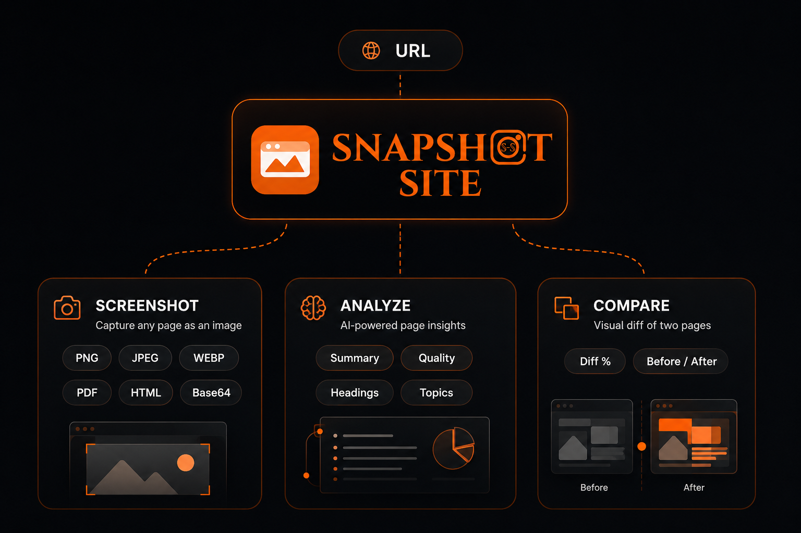
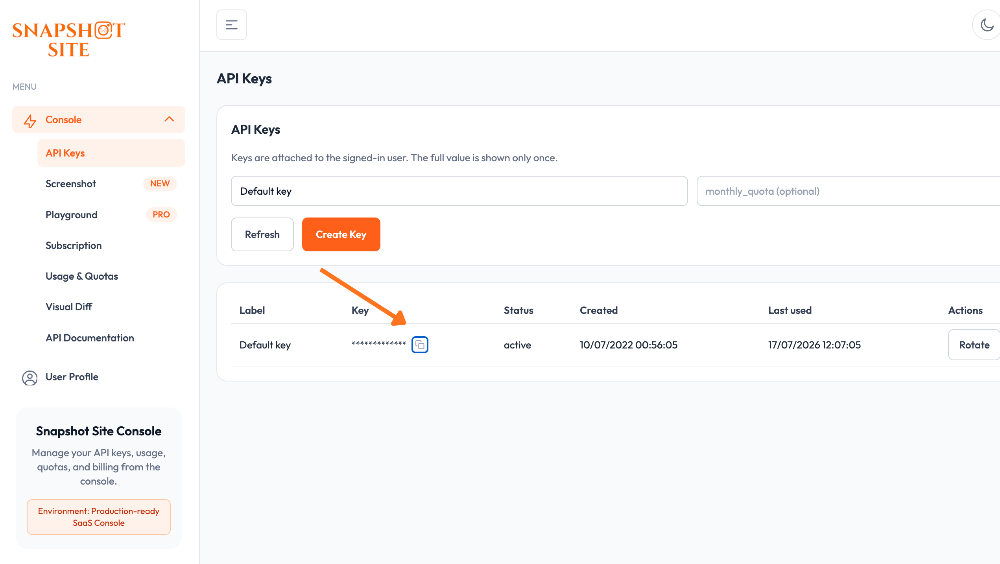
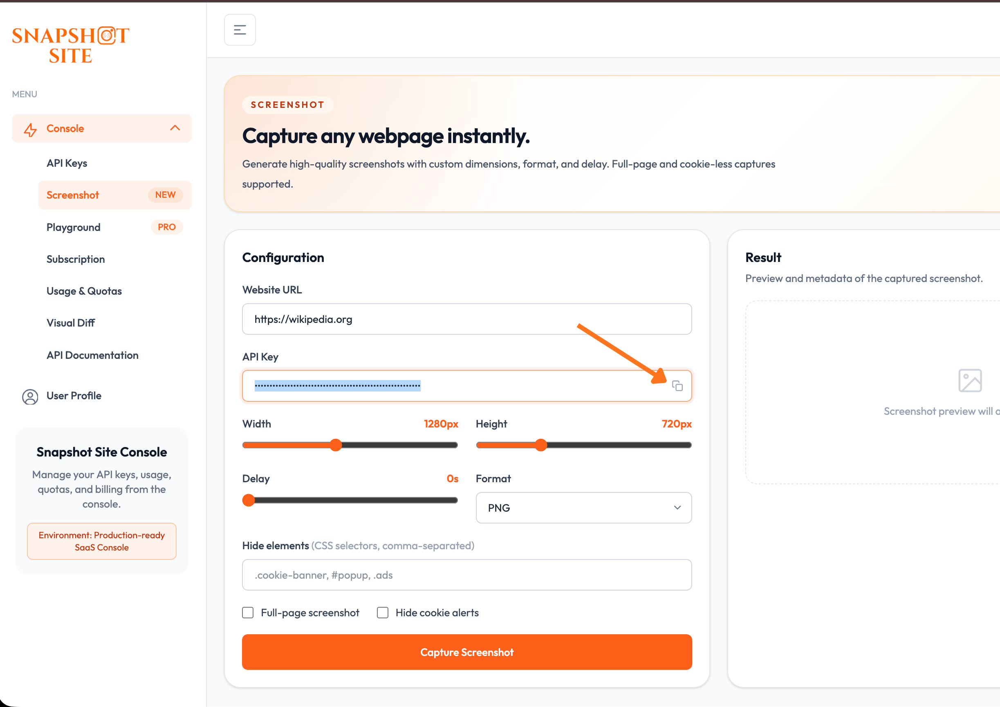

# n8n-nodes-snapshot-site

This is an n8n community node. It lets you use [Snapshot Site](https://snapshot-site.com) in your n8n workflows.

Snapshot Site is a screenshot, AI page-analysis, and visual-diff API for websites.

[n8n](https://n8n.io/) is a [fair-code licensed](https://docs.n8n.io/sustainable-use-license/) workflow automation platform.

[Installation](#installation)
[Operations](#operations)
[Credentials](#credentials)
[Compatibility](#compatibility)
[Usage](#usage)
[Resources](#resources)
[Version history](#version-history)

## Installation

Follow the [installation guide](https://docs.n8n.io/integrations/community-nodes/installation/) in the n8n community nodes documentation, and install `n8n-nodes-snapshot-site`.

## Operations

The **Snapshot Site** node supports three operations:

| Operation   | Endpoint                  | Description                                                                            |
| ----------- | ------------------------- | ---------------------------------------------------------------------------------------- |
| Screenshot  | `POST /api/v2/screenshot` | Capture a screenshot of a webpage as PNG, JPEG, WebP, PDF, base64, or raw HTML            |
| Analyze     | `POST /api/v3/analyze`    | Capture a page and run AI-powered summary, topic, quality, and heading extraction on it   |
| Compare     | `POST /api/v3/compare`    | Capture a "before" and "after" page (or image) and return a pixel-diff comparison         |

## Credentials

You need a Snapshot Site API key to use this node.

1. Sign up for a [Snapshot Site Console](https://console.snapshot-site.com/) account.
2. Create an API key on the [API Keys](https://console.snapshot-site.com/api-keys) page.

   
3. In n8n, create a new **Snapshot Site API** credential and paste the key into **API Key**.
4. Leave **Base URL** as the default (`https://api.prod.ss.snapshot-site.com`) unless you're pointed at a self-hosted or staging instance.

## Compatibility

Requires n8n v1.0 or later. Tested against n8n's declarative node routing engine using `@n8n/node-cli` v0.38.

## Usage

### Basic Example

Not sure which options to use? Preview a capture and its parameters in the [Screenshot](https://console.snapshot-site.com/screenshot) console playground before wiring them into the node.

### Screenshot

Set **Operation** to `Screenshot`, enter a **URL**, and optionally expand **Additional Fields** to set the format, viewport size, full-page capture, cookie-banner hiding, custom JavaScript, element hiding, language, or country.

### Analyze

Set **Operation** to `Analyze`, enter a **URL**, and optionally enable **Enable AI Summary** / **Enable Quality Check** in **Additional Fields** to get a content summary, topics, headings, and a quality report (blank-page/CAPTCHA detection, readability score) alongside the screenshot.

### Compare

Set **Operation** to `Compare`, enter a **Before URL** and **After URL** (each can be overridden with an **Image URL** in their respective **Options** to diff against an existing image instead of a live page), and adjust **Threshold** (0-1) to control how sensitive the mismatch detection is.

If you're new to n8n, see the [Try it out](https://docs.n8n.io/try-it-out/) documentation to get started.

## Resources

- [n8n community nodes documentation](https://docs.n8n.io/integrations/#community-nodes)
- [Snapshot Site API documentation](https://snapshot-site.com/api-docs)
- [Snapshot Site Console](https://console.snapshot-site.com)

## Version history

See [CHANGELOG.md](CHANGELOG.md).
